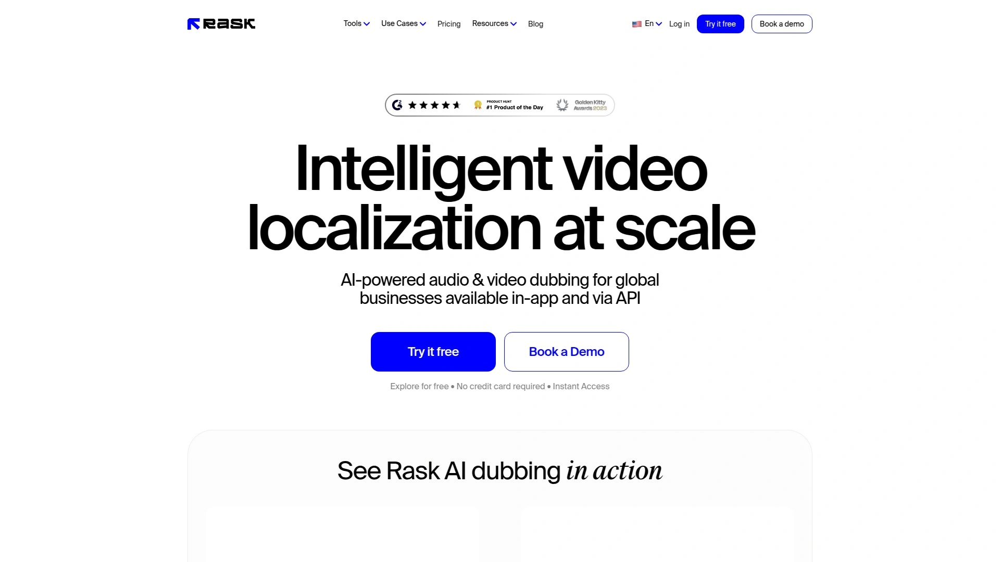
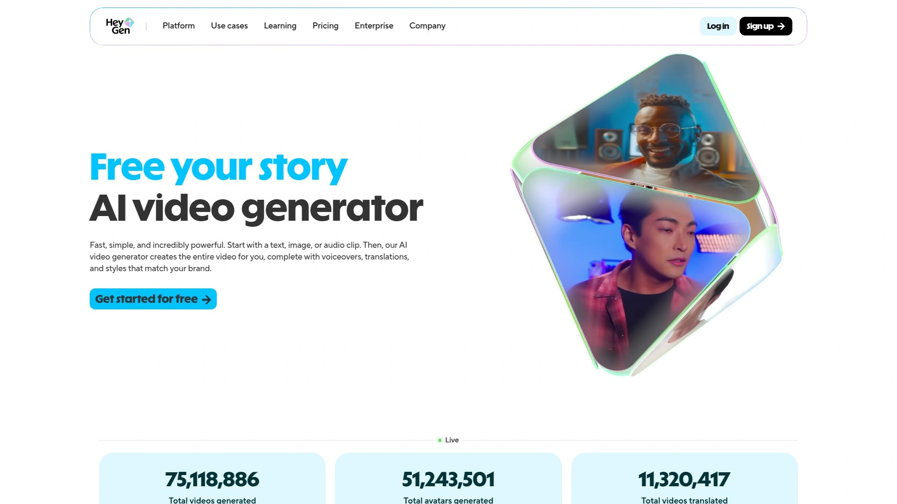
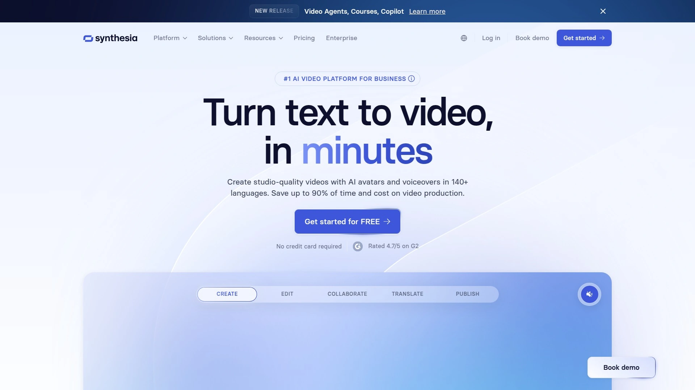
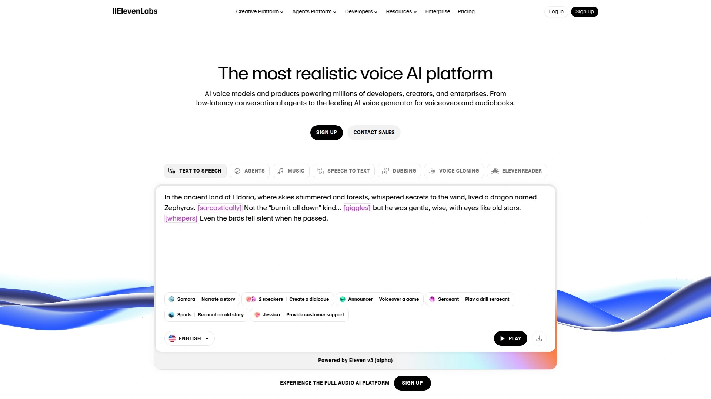
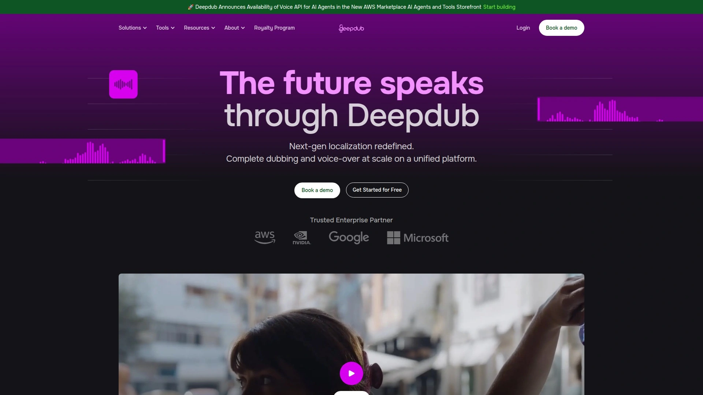
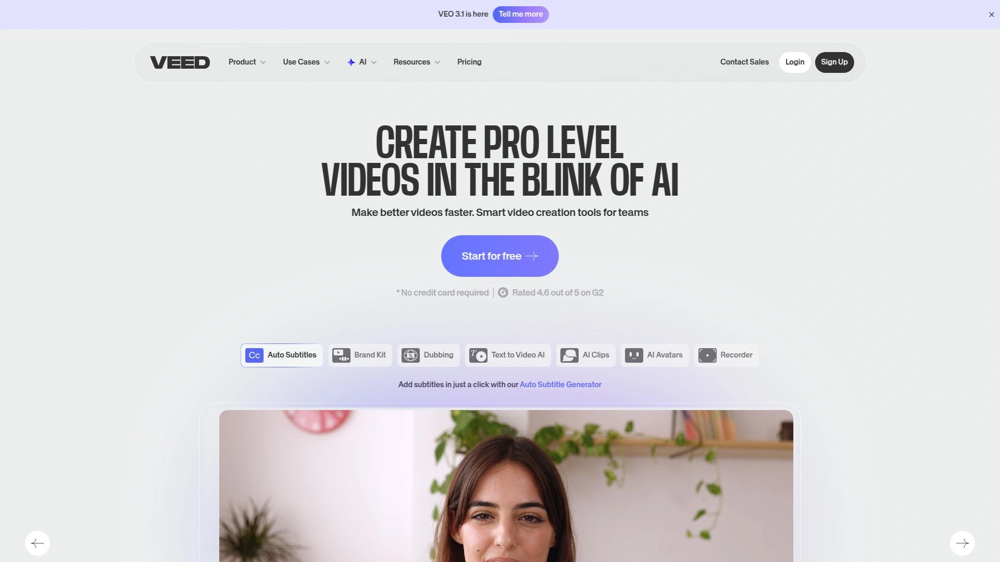
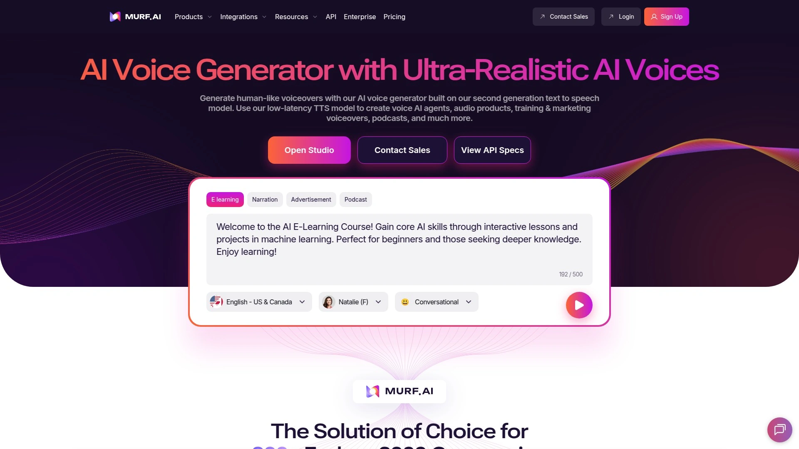
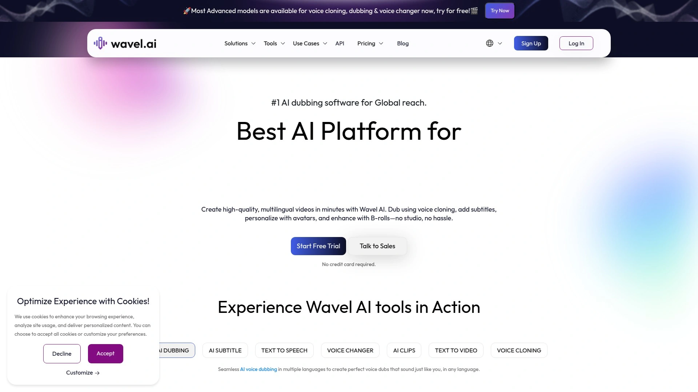
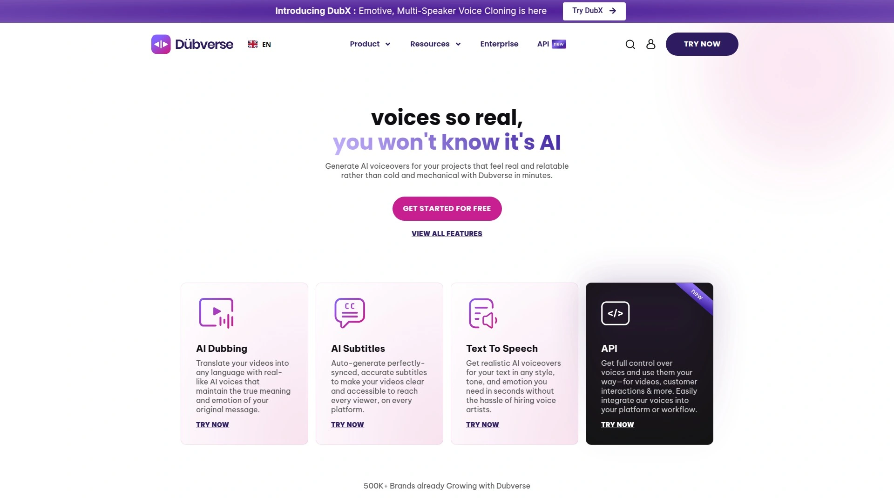
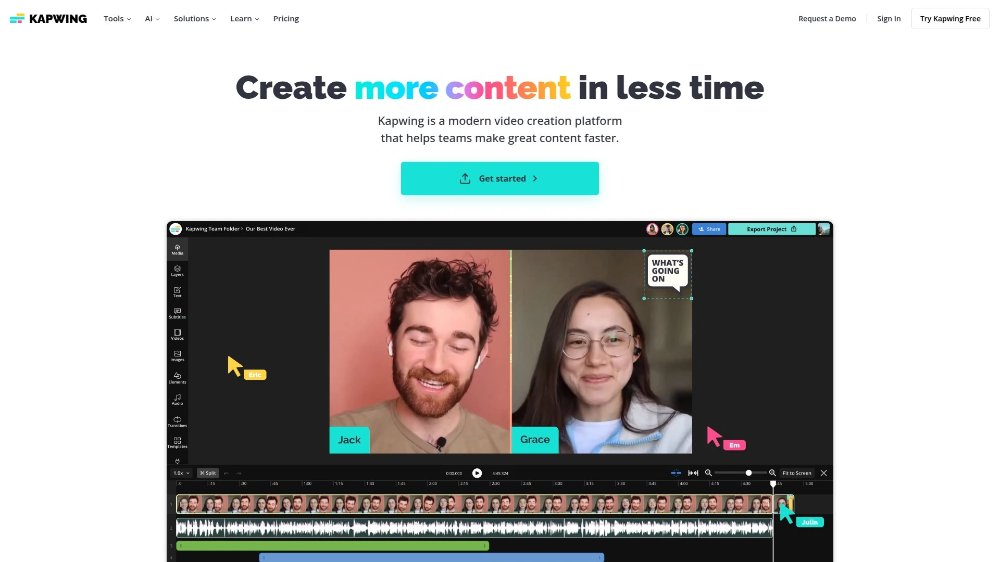

# Top 12 AI Video Translation Tools Ranked in 2025 (Latest Compilation)

Running a YouTube channel or online course that only speaks one language? You're basically leaving money on the table. The thing is, AI video translation tools have gotten ridiculously good at turning a single video into dozens of language versions, and it's way faster and cheaper than hiring voice actors for each market.

These platforms can handle everything from automatic dubbing and voice cloning to subtitle generation and lip-sync adjustments, making your content sound natural in 30+ languages without reshoots. Whether you're a creator expanding internationally or a business training global teams, these tools deliver faster turnaround times at a fraction of traditional localization costs.

---

## **[Rask AI](https://www.rask.ai)**

The go-to choice for creators who need speed without compromising quality.

Rask AI handles video and audio dubbing across 130+ languages with impressive multi-speaker detection that accurately identifies different voices in your content. The platform automatically generates and syncs captions while maintaining the original speaker's tone and emotion, making it ideal for educational content, marketing videos, and entertainment.

What makes it particularly useful is the voice cloning feature that preserves your unique speaking style across translations. You can upload videos directly or work through their API for bulk processing, which is perfect if you're dealing with high-volume content daily. The interface is straightforward—upload your video, select target languages, and get dubbed versions back in minutes rather than weeks.

**Best for:** YouTubers, online educators, and marketing teams who need quick turnaround on short-to-medium-form content without extensive post-production.

***

## **[HeyGen](https://www.heygen.com)**

Perfect lip-sync technology that makes translated videos look genuinely native.

HeyGen stands out with its advanced lip-sync capability that matches translated speech precisely with facial movements, creating videos that don't feel dubbed at all. Supporting 175+ languages and dialects, it goes beyond basic translation by preserving your authentic voice tone through AI voice cloning.

The platform offers one-click translation from YouTube links or uploaded files, plus a multilingual video player that can be embedded on any website or learning management system. This makes it especially valuable for brands running localized ad campaigns or educators delivering courses to international students.

You can refine subtitles, adjust voice tone, and customize settings to match brand guidelines, all within the same workspace. The combination of speed, accuracy, and visual authenticity makes HeyGen a solid choice when viewer engagement is critical.

**Best for:** Brand marketers creating regional ad campaigns and content creators who prioritize natural-looking dubbed videos.

***

## **[Synthesia](https://www.synthesia.io)**

AI avatars meet multilingual dubbing for corporate training and professional content.

Synthesia combines AI-generated avatars with authentic multilingual dubbing across 32+ languages, preserving the original speaker's voice characteristics. The platform excels at creating professional training videos, product demos, and corporate communications without requiring on-camera talent.

What sets it apart is the ability to generate entirely new video content using AI avatars that speak in multiple languages with natural facial expressions and gestures. For existing videos, the dubbing feature maintains voice quality while adding precise lip-sync, making it suitable for high-stakes business content.

The editing workflow includes secure script refinement and quality translation with cultural awareness built in. Companies use Synthesia to scale learning and development materials across global teams without constantly re-recording.

**Best for:** Enterprise teams producing training videos, HR onboarding content, and internal communications for multinational workforces.

***

## **[ElevenLabs](https://elevenlabs.io)**

Ultra-realistic voice cloning with emotional depth and prosody control.

ElevenLabs delivers some of the most lifelike AI voices available, with neural models that capture subtle emotional nuances and natural speech patterns. The dubbing studio supports 29+ languages and specializes in voice cloning that maintains the speaker's unique timbre and speaking style.

You get fine-grained control over prosody, emotion, pacing, and intonation—useful when the feeling behind the words matters as much as the words themselves. Content creators use it for podcasts, YouTube videos, and audiobooks where voice authenticity directly impacts listener trust.

The platform integrates well with other video editing tools, though it focuses primarily on audio rather than visual lip-syncing. Processing is fast, and the quality holds up even with complex speaking patterns or technical vocabulary.

**Best for:** Podcasters, audiobook creators, and YouTubers who need broadcast-quality voice work with emotional authenticity.

---

## **[Deepdub](https://deepdub.ai)**

Studio-quality dubbing for film, television, and high-budget productions.

Deepdub targets professional media companies with fully managed localization pipelines and custom voice cloning for premium content. Supporting 130+ languages with advanced emotional voice synthesis, it delivers the audio quality you'd expect from traditional dubbing studios.

The platform offers a managed service model where their team handles the entire localization workflow, from translation accuracy to voice casting and final mix. This makes it ideal for entertainment companies, streaming platforms, and film producers who can't compromise on audio fidelity.

Real-time translation and dubbing maintain the original tone, pacing, and emotional impact across languages. The voice cloning produces accurate digital replicas that work consistently across entire series or film franchises.

**Best for:** Film studios, streaming services, and media companies producing feature-length content for international distribution.

---

## **[Papercup](https://www.papercup.com)**

Scalable AI dubbing designed for e-learning and publishing at volume.

Papercup focuses on automated dubbing at scale, with seamless integration into existing video hosting platforms and content management systems. The platform supports 70+ languages and offers API access for teams processing large content libraries.

It's particularly strong in educational content and online publishing, where consistent voice quality across hundreds of videos matters more than individual customization. The dubbing quality sits at "very good" with solid lip-sync capabilities, making it suitable for professional courses and training materials.

The service includes project management tools for organizing large translation projects and tracking progress across multiple languages. Pricing is competitive for volume users, making it accessible for mid-size educational platforms and content publishers.

**Best for:** E-learning platforms, online course creators, and publishers managing extensive content libraries across multiple languages.

***

## **[VEED.io](https://www.veed.io)**

All-in-one browser-based video editor with built-in translation and dubbing.

VEED combines video editing, subtitle generation, translation, and dubbing in a single browser-based platform with 99.9% translation accuracy. You don't need to install software—everything runs online with projects saved to the cloud.

The subtitle editor is interactive and real-time, letting you adjust translations, customize text styling, and position captions exactly where you want them. You can remove hardcoded subtitles, add auto-captions, and translate audio with natural-sounding AI voices all in one workspace.

It's designed for creators who need quick edits and don't want to juggle multiple specialized tools. The interface is intuitive enough for beginners but includes enough features for professional use cases like social media content and marketing videos.

**Best for:** Social media managers, content marketers, and creators who want a simple all-in-one solution for editing and localizing videos.

***

## **[Murf AI](https://murf.ai)**

Professional voiceover platform with robust dubbing and 30x speed improvement.

Murf AI delivers dubbing in 30+ languages with ultra-natural, human-like voices and customizable emotional tone. The platform processes dubbing projects 30x faster than traditional methods by eliminating manual translation, studio recordings, and multiple revision rounds.

What's particularly useful is the exact duration matching and seamless sync, which means you don't need to manually adjust timelines or worry about dialogue alignment. Expert linguistic review from native speakers ensures translations sound authentic and culturally appropriate.

The platform includes 150+ professional multilingual AI voices with fine-grained control over pitch, speed, pauses, and pronunciation. You can export dubbed videos in MP4 format optimized for YouTube, TikTok, and Instagram without quality compromise.

**Best for:** Content creators, podcasters, and marketing agencies producing branded videos that need consistent voice quality across languages.

***

## **[CAMB.AI](https://www.camb.ai)**

Enterprise-grade localization in 150+ languages with gold-standard AI accuracy.

CAMB.AI positions itself as the gold standard for AI-powered localization, trusted by major sports organizations and entertainment companies for large-scale content translation. The platform supports 140+ languages with advanced voice cloning and real-time dubbing capabilities.

It's built for brands and creators who need to localize massive content libraries while maintaining original voice characteristics and emotional delivery. The technology handles everything from educational videos to sports broadcasts with high translation accuracy and cultural awareness.

Enterprise features include dedicated support, custom integrations, and workflow management for teams coordinating complex localization projects. The platform scales effortlessly from individual videos to thousands of hours of content.

**Best for:** Large enterprises, sports organizations, and entertainment companies managing global content distribution at scale.

***

## **[Wavel AI](https://wavel.ai)**

Full-stack video creation suite with dubbing, voice cloning, and avatar generation.

Wavel AI goes beyond basic dubbing to offer a comprehensive video creation platform with voice cloning, AI avatars, subtitle generation, and video editing. Supporting 100+ languages, it lets you create high-quality multilingual videos without studios or extensive equipment.

The voice cloning is notably accurate, producing personalized audio at scale without hiring voice actors. You can turn scripts into complete videos with visuals, voice, and subtitles using the AI video generator, or dub existing content with perfect lip-sync.

Additional tools include screen recording, video-to-shorts conversion for social media, and a voice changer for managing multiple brand personas. Everything happens in one workspace, eliminating the need to juggle separate tools for each task.

**Best for:** Creators, marketers, and educators who want a versatile platform that handles dubbing, video creation, and social media repurposing in one place.

***

## **[Dubverse](https://dubverse.ai)**

Fast multilingual dubbing with simplified workflow for quick content localization.

Dubverse focuses on speed and simplicity, offering video dubbing that translates content into 30+ languages while maintaining the original message's meaning and emotion. The platform is designed for creators who need reliable translations without extensive technical knowledge.

It provides basic lip-sync capabilities and natural-sounding AI voices at accessible price points starting around $20/month. The workflow is streamlined—upload your video, select languages, and receive dubbed versions ready for publishing.

While it may not offer the advanced customization of premium platforms, Dubverse hits a sweet spot for creators who prioritize speed and affordability over fine-tuned control. It's particularly popular with educational content creators and small business owners expanding into new markets.

**Best for:** Small businesses, independent educators, and content creators who need affordable, straightforward video translation without complex features.

***

## **[D-ID](https://www.d-id.com)**

AI video translation with innovative face animation and lip-sync technology.

D-ID brings unique face animation capabilities to video translation, adjusting lip movements to match translated words while cloning the speaker's voice. The AI Video Translate tool supports 30+ languages and helps enterprises create AI-powered videos for global audiences.

Beyond translation, D-ID specializes in animating photographs and creating interactive AI agents with customizable appearances and voices. This makes it valuable for brands creating virtual spokespersons or interactive customer service experiences.

The voice cloning technology captures natural speech patterns, emotional nuances, and accents with near-human accuracy. Enterprise customers use it to scale content production for podcasts, audiobooks, and video narration while improving accessibility.

**Best for:** Enterprises creating interactive AI experiences, brands developing virtual ambassadors, and businesses needing multilingual customer-facing content.

---

## **[Kapwing](https://www.kapwing.com)**

Collaborative online editor with comprehensive translation and dubbing tools for teams.

Kapwing delivers accurate video translation using AI from trusted platforms like GPT, Google, and DeepL, achieving 99% translation accuracy. The platform combines dubbing, subtitles, and lip-syncing in one online studio without requiring software installation.

Subtitles auto-generate when translating videos and can be customized with various fonts, colors, and design options to match brand identity. The karaoke-style subtitle display makes videos more accessible for language learners and improves viewer engagement.

Team collaboration features let multiple people work on translation projects simultaneously, making it practical for agencies and in-house content teams. You can translate single videos or entire content catalogs with a diverse voice library of studio-quality narrators.

**Best for:** Content marketing teams, social media agencies, and educational content creators who need collaborative translation workflows with branded styling.

***

## FAQ

**Which AI video translation tool works best for YouTube content creators on a budget?**

For YouTubers working with limited budgets, Dubverse and VEED.io offer the best value, with pricing around $20-25/month and solid translation quality across 30+ languages. Both platforms deliver fast turnaround times and simple workflows that don't require technical expertise. If you're processing high volumes of content, Rask AI provides efficient multi-speaker detection and voice cloning at competitive rates.

**Can these tools maintain my voice's personality across different languages?**

Yes, most advanced platforms like Rask AI, HeyGen, and ElevenLabs use voice cloning technology that preserves your unique tone, speaking style, and emotional delivery across translations. The voice models capture subtle characteristics like pacing, inflection, and timbre, making dubbed versions sound authentically like you rather than a generic AI voice. Quality varies by platform, so test with sample content before committing to large projects.

**How accurate are AI translations compared to human translators?**

Modern AI video translation tools achieve 98-99% accuracy for most languages, combining transcription, contextual translation, and voice synthesis. Platforms like VEED, Kapwing, and Murf AI use models trained on massive datasets that understand cultural context and idiomatic expressions. However, for highly technical, legal, or culturally nuanced content, platforms like Papercup and CAMB.AI offer expert linguistic review by native speakers to ensure authenticity.

***

## Conclusion

If you're serious about taking your content global without burning through time and budget, these AI video translation tools handle the heavy lifting that used to require entire localization teams. [Rask AI](https://www.rask.ai) hits the sweet spot for creators and businesses who need fast, accurate dubbing with voice cloning across 130+ languages—especially when you're working with educational content, marketing videos, or multi-speaker recordings that need to sound natural in every target market. The multi-speaker detection and automatic caption sync save hours of manual editing while maintaining the authenticity that keeps audiences engaged.
